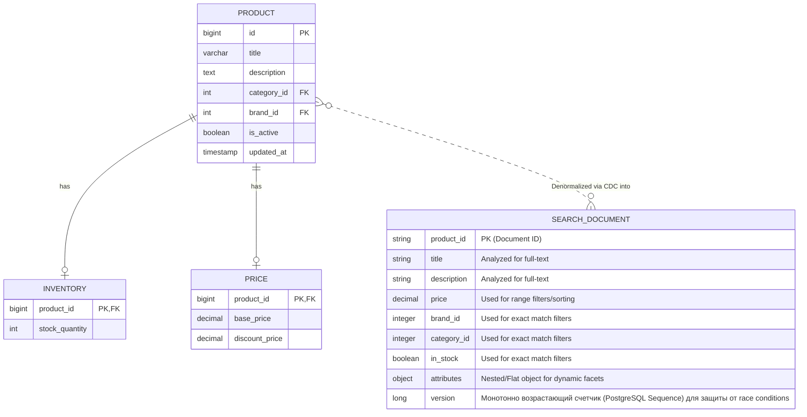
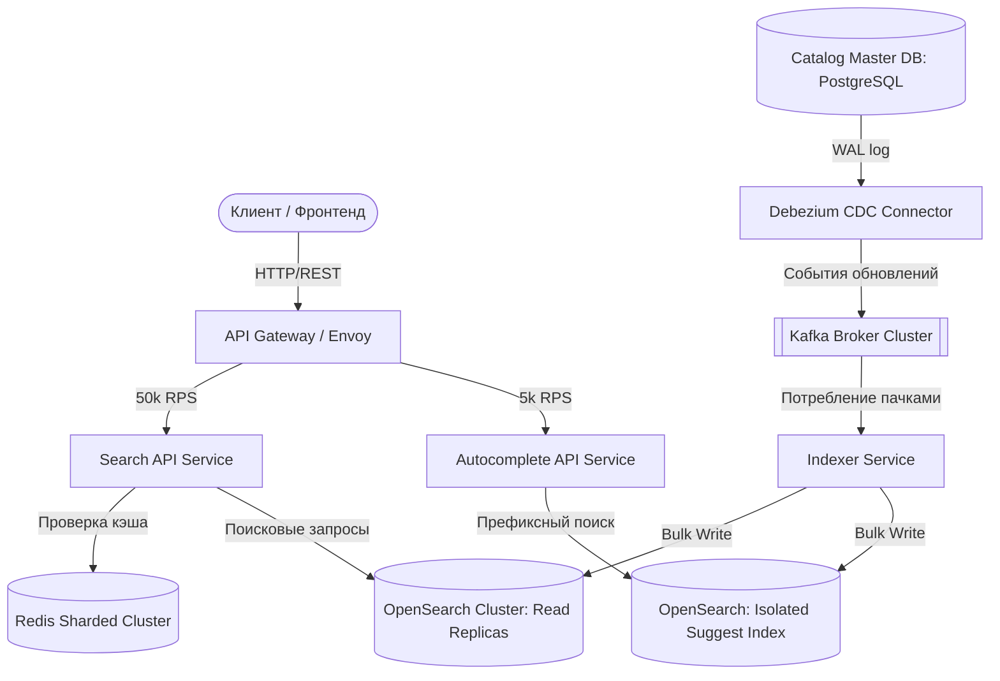
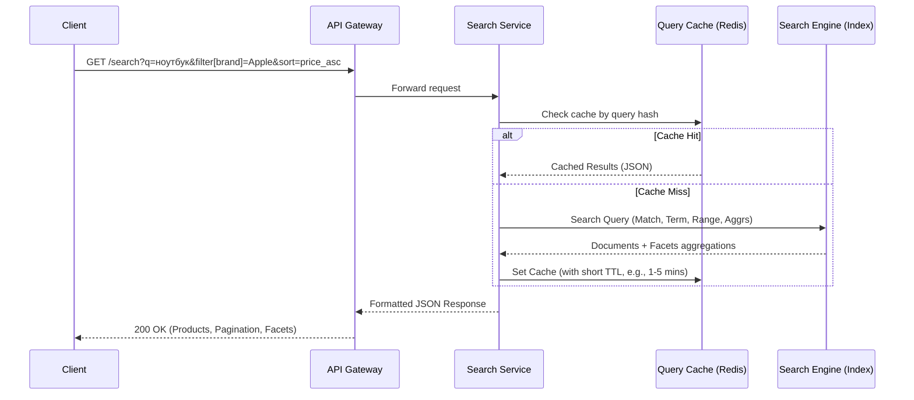
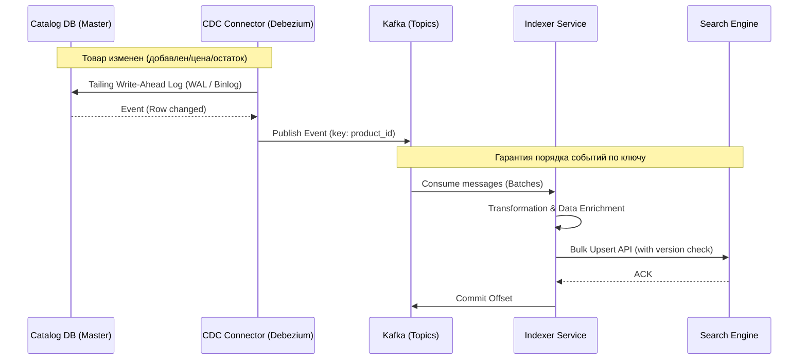

# Техническое решение: Поисковая подсистема интернет-магазина

---

## 1. Введение

«Поисковая подсистема интернет-магазина» — это распределенный высоконагруженный сервис, предназначенный для обеспечения быстрого и релевантного поиска товаров по текстовым запросам пользователей. Проект спроектирован с учетом требований к Highload-системам: он выдерживает пиковые нагрузки на чтение (до 50 000 RPS), обеспечивает минимальные задержки (Low Latency) и поддерживает горизонтальное масштабирование. 

Архитектура строится на паттерне CQRS (Command Query Responsibility Segregation) и концепции Eventual Consistency (согласованность в конечном счете). Основным источником истины (Source of Truth) остается мастер-система «Каталог товаров», в то время как поисковая подсистема выступает оптимизированной read-моделью, данные в которую поступают асинхронно. Это позволяет полностью изолировать поисковую нагрузку от транзакционной БД магазина и гарантировать отказоустойчивость клиентского поиска даже при временной недоступности основного каталога.

---

## 2. Глоссарий

| Термин | Определение |
| :--- | :--- |
| **Каталог товаров (Master Catalog)** | Основное транзакционное хранилище данных магазина. Выступает источником истины (Source of Truth) о товарах, ценах и остатках. |
| **Поисковый индекс (Search Index)** | Специализированная структура данных (как правило, инвертированный индекс), оптимизированная для сверхбыстрого полнотекстового поиска и фильтрации. |
| **Документ (Document)** | Денормализованное представление товара в поисковом индексе, содержащее все необходимые поля для поиска, фильтрации и отображения в выдаче. |
| **Фильтр (Filter)** | Условие или набор условий для ограничения поисковой выдачи по заданным атрибутам (цена, бренд, наличие и т.д.). |
| **Сортировка (Sorting)** | Правило упорядочивания найденных документов в выдаче (например, по релевантности, по возрастанию или убыванию цены). |
| **Autocomplete (Подсказки)** | Механизм мгновенной выдачи релевантных вариантов продолжения запроса или конкретных товаров по мере ввода текста пользователем (префиксный поиск). |
| **Релевантность (Relevance)** | Метрика степени соответствия найденного товара интенту (ожиданиям) пользователя, выраженному в текстовом запросе. |
| **Reindex (Переиндексация)** | Процесс полного или частичного обновления поискового индекса на основе актуальных данных из Каталога товаров. |
| **CDC (Change Data Capture)** | Паттерн захвата изменений в базе данных Каталога для их последующей асинхронной передачи в Поисковую подсистему. |
| **Eventual Consistency** | Модель согласованности, при которой изменения в Каталоге товаров попадают в Поисковый индекс не мгновенно, а с небольшой (обычно миллисекундной) задержкой, но гарантированно применяются. |

---

## 3. Функциональные требования

Система должна предоставлять клиентам и внутренним сервисам следующие возможности:

1. **Полнотекстовый поиск товаров:**
   * Поиск по текстовому запросу с учетом морфологии и опечаток.
   * Возврат денормализованных данных товара для отрисовки выдачи (минимум: `product_id`, название, цена, бренд, категория, статус наличия).
   * Корректная и осмысленная обработка ситуаций с пустым результатом («по запросу ничего не найдено»).
2. **Фасетная фильтрация:**
   * Поддержка одновременного применения нескольких фильтров (категория, бренд, диапазон цены, только в наличии).
   * Пересчет доступных фильтров на основе текущей поисковой выдачи.
3. **Сортировка результатов:**
   * Поддержка сортировки по релевантности (по умолчанию).
   * Сортировка по цене (по возрастанию / по убыванию).
4. **Постраничная навигация (Pagination):**
   * Получение результатов порциями (страницами).
   * Гарантия стабильности выдачи (отсутствие дублей и пропусков товаров при переходе между страницами в рамках одного запроса).
5. **Подсказки при вводе (Autocomplete / Suggest):**
   * Генерация подсказок на основе префикса запроса (по названиям товаров и словарю популярных запросов).
6. **Актуализация данных (Индексирование):**
   * Асинхронное получение событий об изменении данных в Каталоге (добавление новых товаров, изменение цен, статуса доступности, описания).
   * Обновление поискового индекса в фоновом режиме.

---

## 4. Нефункциональные требования

Архитектура системы диктуется жесткими требованиями к производительности и надежности:

### 4.1. Нагрузка (Throughput & Traffic Profile)
* **Профиль нагрузки:** Ярко выраженный Read-Heavy (опережающий поток чтений над записями). Короткие интерактивные запросы. Постоянный фоновый поток обновлений от Каталога.
* **Пиковая нагрузка на поиск и фильтрацию:** До 50 000 RPS.
* **Пиковая нагрузка на подсказки (Autocomplete):** До 5 000 RPS.

### 4.2. Производительность (Latency Targets)
* **Поиск, фильтрация и сортировка:** P95 <= 200 мс.
* **Подсказки (Autocomplete):** P95 <= 100 мс.

### 4.3. Согласованность данных (Consistency)
* Допускается **Eventual Consistency** между Каталогом товаров и Поисковым индексом. Задержка обновления данных в поиске (Replication Lag) в штатном режиме не должна превышать нескольких секунд.
* Поиск должен работать и отдавать результаты даже в случае временной деградации или падения сервиса синхронизации данных (изоляция отказов).

### 4.4. Надёжность и отказоустойчивость (Reliability)
* Гарантия отсутствия потери данных (At-least-once доставка) об изменениях каталога.
* Идемпотентность обработчиков событий: система должна корректно переваривать дубли событий изменения товара или приход событий в нарушенном порядке (использование поля `version` или `updated_at` для защиты от перезаписи свежих данных старыми).
* Доступность API поиска (SLA): 99.99%.

### 4.5. Масштабируемость (Scalability)
* Горизонтальное масштабирование (Scale-out) узлов обработки поисковых запросов (Search API).
* Горизонтальное масштабирование самого поискового движка (шардирование индекса по `product_id`, добавление read-реплик для балансировки трафика).
* Независимое масштабирование контура Autocomplete (отдельный легковесный индекс/кэш).
* Изоляция ресурсов: тяжелые запросы на индексацию (запись) не должны аффектить задержки на чтение у пользователей.

---

## 5. Пользовательские сценарии

### Сценарий 1: Быстрые подсказки (Autocomplete)
1. Пользователь начинает вводить поисковый запрос (например, «смартф...») в строку поиска.
2. Система мгновенно (с задержкой до 100 мс) возвращает список популярных продолжений запроса (сайджесты) и превью 3-5 наиболее релевантных товаров.
3. Пользователь выбирает подсказку или продолжает ввод.

### Сценарий 2: Поиск, фильтрация и сортировка
1. Пользователь вводит запрос «ноутбук» и нажимает «Найти».
2. Система возвращает первую страницу (например, 24 товара), отсортированную по релевантности, и список доступных фасетных фильтров (бренды, цены, характеристики), подсчитанных для выборки «ноутбук».
3. Пользователь выбирает фильтр «Бренд: Apple» и сортировку «Сначала дешевые».
4. Система возвращает обновленный список из ноутбуков Apple, отсортированный по возрастанию цены, и пересчитанные фильтры.

### Сценарий 3: Пустая выдача (Zero-result)
1. Пользователь вводит несуществующий запрос или запрос с опечатками, которые система не смогла исправить (например, «аблвпл ноутбук»).
2. Система определяет, что релевантных товаров нет.
3. Вместо технической ошибки система возвращает статус успешного ответа с пустым списком, а также блок рекомендаций (популярные категории магазина или «возможно, вы искали»).

### Сценарий 4: Добавление нового товара (Фоновый процесс)
1. Контент-менеджер заводит в Каталоге новый товар (или меняется его цена/остаток в складской системе).
2. Изменения фиксируются в транзакционной базе данных Каталога.
3. Поисковая подсистема асинхронно получает событие об изменении и обновляет документ в поисковом индексе.
4. Спустя несколько секунд новый товар (или его новая цена) становится доступен в поисковой выдаче клиентам.

---

## 6. Модель данных (Data Model)

Для обеспечения требуемой производительности (P95 < 200 мс на 50 000 RPS) использование классической реляционной базы данных (PostgreSQL/MySQL) с большим количеством `JOIN` неэффективно. Данные в поисковом движке (например, OpenSearch/Elasticsearch) хранятся в максимально **денормализованном виде** (плоские документы).

### 6.1. Транзакционная модель vs Поисковый индекс

### 6.2. Особенности хранения в поисковом индексе
1. **Отсутствие JOIN'ов:** Вся информация, необходимая для отрисовки карточки товара в выдаче и работы фильтров, лежит внутри одного JSON-документа.
2. **Анализаторы (Analyzers):** Текстовые поля (`title`, `description`) индексируются с применением стемминга, стоп-слов, синонимов и N-грамм (для поддержки поиска по частям слов и опечаток).
3. **Версионирование (`version`):** Вместо нестабильного использования меток времени (класса `updated_at`), в системе используется монотонно возрастающий счетчик. В PostgreSQL заведен глобальный `SEQUENCE`. При любом изменении товара, его цены или остатка (через триггеры БД или на уровне бизнес-логики) этот счетчик инкрементируется и записывается в поле `version`. Данное поле передается через Debezium в Kafka и используется OpenSearch для механизма Optimistic Concurrency Control (версия в документе обновится только если пришедший `version` строго больше текущего).

## 7. Архитектура системы (System Architecture)

### 7.1. Схема компонентов (High-Level Design)

Архитектура системы спроектирована разделенной на изолированные слои для обеспечения масштабирования и надежности.

### 7.2. Описание компонентов системы

1. **API Gateway (Envoy / Kong):** Единая точка входа. Выполняет функции маршрутизации трафика, Rate Limiting (защита от DDOS/скрейпинга), SSL-терминации и логирования.
2. **Search API Service:** Легковесный stateless-микросервис на Go/Java. Формирует сложные JSON-запросы (DSL) к поисковому движку, оркестрирует работу с кэшем и преобразует сырые документы в красивый клиентский JSON. Горизонтально масштабируется без ограничений.
3. **Autocomplete API Service:** Выделенный микросервис, изолированный от основного поиска. Обрабатывает только ввод «на лету». Изоляция необходима, так как профиль нагрузки здесь требует экстремально низкого Latency (P95 <= 100 мс).
4. **Redis Sharded Cluster:** Высокопроизводительное key-value хранилище в RAM. Служит для кэширования результатов фасетной фильтрации и популярных запросов. Срезает до 60-70% повторяющейся нагрузки с основного поискового движка.
5. **OpenSearch / Elasticsearch Cluster:** Распределенный инвертированный индекс. Делится на Master-ноды (координация), Data-ноды (хранение и запись) и Search-ноды (Read-реплики, обрабатывающие только поисковый трафик).
6. **Debezium + Kafka:** Инфраструктура асинхронного стриминга данных. Гарантирует доставку обновлений из основной БД каталога в поисковый контур без создания нагрузки на CPU транзакционной базы.
7. **Indexer Service:** Воркер, который слушает Kafka, собирает изменения товаров в пачки (микро-батчи) и выполняет пакетное обновление (`_bulk`) индексов OpenSearch.

### 7.3. Подход к фильтрации, сортировке и пагинации

* **Фильтрация и фасеты:** Для построения фильтров используется механизм `aggregations` (в OpenSearch). При этом сами поисковые фильтры оборачиваются в контекст `filter` (а не `query`), что позволяет движку использовать внутренний кэш битсетов (Bitset Caching) и не пересчитывать релевантность (score) для структурных атрибутов (brand_id, category_id).
* **Сортировка:** При сортировке по умолчанию применяется скоринг на основе алгоритма BM25 + веса (boost) для бизнес-метрик (например, популярность товара или маржинальность). При явной сортировке по цене/скидкам скоринг отключается (`constant_score`), что экономит CPU.
* **Пагинация (Важно для Highload):** Использование классического смещения `from` + `size` на больших объемах данных приводит к проблеме "Deep Pagination" (рост потребления RAM и CPU на глубоких страницах). В системе применяется подход **Cursor-based pagination** с использованием механизма `search_after` (в качестве курсора выступает уникальная комбинация `[sort_value, product_id]`), что гарантирует константную сложность O(1) при переходе на любую страницу.

### 7.4. Реализация подсказок (Autocomplete)

Для обслуживания 5 000 RPS на подсказки с жестким лимитом времени ответа применяется комбинированный подход:
1. **Словарь подсказок:** Строится на основе названий категорий, брендов и очищенного лога успешных поисковых запросов пользователей.
2. **Индекс Suggester:** В OpenSearch создается специализированный легковесный индекс, где текстовые поля имеют тип `completion`. Этот тип данных компилируется во внутреннюю структуру FST (Finite State Transducer), которая полностью удерживается в оперативной памяти (RAM) поисковых нод и обеспечивает префиксный поиск за единицы миллисекунд.
3. **Изоляция:** Запросы Autocomplete направляются на физически выделенные поисковые ноды, чтобы тяжелые текстовые запросы основного поиска (с фасетными агрегациями) не вытесняли FST-структуры из RAM.

### 7.5. Масштабируемость под нагрузку (50k / 5k RPS)

* **Шардирование:** Индекс товаров разделен на `Primary Shards` (например, 8 шардов, исходя из объема данных). Шардирование выполняется по хэшу от `product_id`, обеспечивая равномерное распределение документов.
* **Репликация трафика:** Для обеспечения 50 000 RPS на чтение ключевым фактором является горизонтальное увеличение количества `Replica Shards`. Каждая нода-реплика может независимо отвечать на поисковые запросы. Нагрузка между ними балансируется на уровне Search API сервиса с помощью алгоритма Round-Robin или Least Connections.
* **Партиционирование в Kafka:** Топик обновлений товаров в Kafka настраивается с количеством партиций, равным или кратным числу инстансов `Indexer Service`. Ключом партиционирования является `product_id` — это гарантирует, что все изменения конкретного товара попадут в один и тот же поток и будут обработаны строго последовательно.

### 7.6. Отказоустойчивость и актуальность (Resilience & Consistency)

* **Защита от каскадных сбоев (Circuit Breaker):** В случае деградации OpenSearch (например, рост P95 > 500 мс), Search API активирует Circuit Breaker и начинает мгновенно отдавать клиентам данные из Redis (даже если они слегка устарели) или пустой результат с блоком статических рекомендаций, сохраняя работоспособность всего сайта.
* **Идемпотентность записи:** Поскольку Kafka гарантирует доставку *At-least-once*, возможны дубли сообщений. При вставке документа в OpenSearch в качестве идентификатора документа используется `product_id`, а в качестве параметра `version` передается значение Sequence-счетчика из PostgreSQL. OpenSearch автоматически отклоняет старые версии документов, если в индексе уже лежит более свежая запись.

### 7.7. Компромиссы архитектурного решения (Trade-offs)

При проектировании системы были сделаны следующие осознанные компромиссы:

1. **Eventual Consistency вместо Strong Consistency:**
   * *Компромисс:* Изменения цены или наличия товара видны в поиске не мгновенно (отставание до 1-3 секунд). 
   * *Обоснование:* Попытка сделать синхронное обновление индекса в рамках ACID-транзакции основного каталога разрушила бы производительность всей системы и завязала бы доступность поиска на доступность БД каталога.
2. **Денормализация (Объем диска и RAM) вместо Нормализации:**
   * *Компромисс:* Данные брендов, категорий и цен дублируются в каждом документе товара. Индексы занимают значительно больше дискового пространства и требуют больших объемов RAM для кэширования операционной системой.
   * *Обоснование:* Скорость поиска O(1) по одному документу без тяжелых `JOIN` операций является главным условием обеспечения P95 <= 200 мс на 50 000 RPS.
3. **Кэширование на стороне Redis:**
   * *Компромисс:* Риск отдачи неактуальных фильтров (например, товар уже раскупили, а в кэше он еще числится "в наличии" в течение 1 минуты TTL).
   * *Обоснование:* Снижение нагрузки на поисковый кластер в пиковые часы перевешивает незначительную рассинхронизацию фасетных фильтров, которая финально валидируется на этапе оформления заказа в корзине.

### 7.8. Процедура полной переиндексации (Full Reindex)

Полная переиндексация необходима при изменении структуры индекса (mapping), добавлении новых языковых анализаторов или в случае критического рассинхрона данных. Для обеспечения доступности поиска в режиме 24/7 (Zero Downtime) процедура реализуется по паттерну **Blue-Green индексирования** с использованием механизма псевдонимов (Aliases):

1. **Использование Алиасов:** Клиентские сервисы никогда не ходят в физический индекс напрямую. Они работают с абстрактным алиасом `products_live`, который указывает на текущий актуальный индекс (например, `products_v1`).
2. **Создание теневого индекса:** Инфраструктура запускает создание нового изолированного индекса `products_v2` с измененной конфигурацией.
3. **Историческая загрузка:** Запускается фоновый скрипт (мигратор), который вычитывает всю историческую базу данных Каталога товаров пачками (Cursor-based) и делает Bulk-вставки в `products_v2`.
4. **Параллельный стриминг изменений:** Во время работы мигратора живой поток обновлений из Kafka (CDC) начинает дублироваться: `Indexer Service` пишет события одновременно и в `products_v1`, и в `products_v2`. Благодаря сверке `version` (Sequence), исторические данные не затрут свежие изменения, если мигратор дойдет до них позже.
5. **Переключение указателя:** Как только мигратор завершает работу, а отставание (lag) записи в `products_v2` становится равным нулю, выполняется атомарная операция в OpenSearch: алиас `products_live` переключается с `products_v1` на `products_v2`.
6. **Очистка ресурсов:** Старый индекс `products_v1` удаляется через несколько часов после успешного мониторинга метрик.
---

## 8. Технические сценарии и потоки данных

Архитектура разделена на контур чтения (обработка пользовательских запросов) и контур записи (актуализация индекса).

### 8.1. Сценарий: Обработка поискового запроса (Read Path)
Поиск и фасетная фильтрация — это вычислительно сложная операция. Для защиты поискового движка от перегрузки используется API-слой и кэширование.

*Примечание:* Вместо ручного вычисления "популярных" запросов, в Redis Cluster настраивается автоматическая политика вытеснения данных **LRU (Least Recently Used)**. В кэш сохраняются абсолютно все поисковые ответы, но при заполнении выделенной оперативной памяти Redis самостоятельно удаляет самые редко используемые записи. Емкость RAM для кластера Redis рассчитывается из бизнес-предположения, что 20% уникальных популярных запросов покрывают около 80% поискового трафика (закон Парето). Для предотвращения долгого отображения неактуальных данных для всех записей выставляется TTL (например, 5 минут).

### 8.2. Сценарий: Обновление индекса (Write Path / CDC)

Для обеспечения Eventual Consistency без нагрузки на основную БД используется паттерн **Change Data Capture (CDC)** в связке с брокером сообщений.

***

**Особенности реализации (Сборка документа и Partial Updates):**

* **Частичные обновления (Partial Updates):** Так как Каталог товаров нормализован (таблицы Product, Inventory, Price независимы), Debezium генерирует разрозненные события (diff) по конкретным строкам. Чтобы `Indexer Service` не совершал тяжелых запросов в мастер-БД для полной сборки JSON-документа, используется API частичныхновлений OpenSearch (`_update` API). 
  * Если пришло событие об изменении цены из таблицы `PRICE`, Indexer отправляет точечный патч: `{ "doc": { "price": new_price } }`.
  * Если изменился остаток в `INVENTORY`, отправляется патч: `{ "doc": { "in_stock": true/false } }`.

* **Оптимизация записи:** OpenSearch на своей стороне точечно обновляет нужные поля в существующем документе по `product_id`, сохраняя высокую производительность. При этом всегда проверяется поле `version` (полученное из глобального Sequence БД), чтобы исключить применение «старого» диффа поверх «нового».

* **Пакетная обработка (Batching):** `Indexer Service` накапливает сообщения из Kafka (например, по 500 штук или раз в секунду) и отправляет в поисковый движок через `_bulk` API, что кардинально снижает I/O нагрузку на диски кластера.

* **Надежность:** Если кластер поиска временно недоступен, сообщения безопасно буферизуются в Kafka. При восстановлении движка индекс догонит мастер-базу без потери данных.
